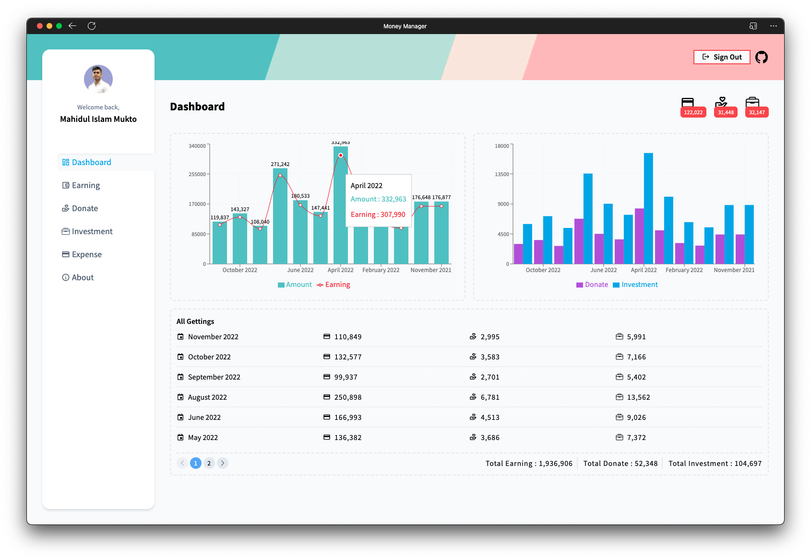

# Firebase & Next.js Money Manager


Personal Money Manager app With Next.js and Firebase.


### `Environment` variables
.env.local
```javascript
NEXT_PUBLIC_API_KEY = apiKey
NEXT_PUBLIC_AUTHDOMAIN = authDomain
NEXT_PUBLIC_PROJECTID = projectId
NEXT_PUBLIC_STORAGEBUCK = storageBucket
NEXT_PUBLIC_MESSAGING = messagingSenderId
NEXT_PUBLIC_APPID = appId
```

###  `App` Screenshots


[  ](assets/img/screenshot-2.png)

###  `Tech` Stack 
 - [Next.js](https://nextjs.org/)
 - [Tailwind css](https://tailwindcss.com/)
 - [MomentJS](https://momentjs.com/)
 - [React Icons](https://react-icons.github.io/react-icons/)

###  `Host` On
 - [Netlify](https://www.netlify.com/)

###  `Live` Link
https://mukto-money-manager.netlify.app/

### `Links`
[](https://mukto.info/)
[](https://www.linkedin.com/in/muktoapb/)
[](https://twitter.com/muktoapb)

